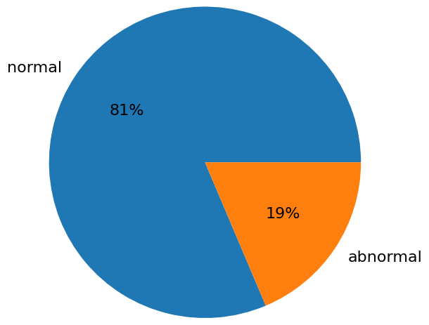
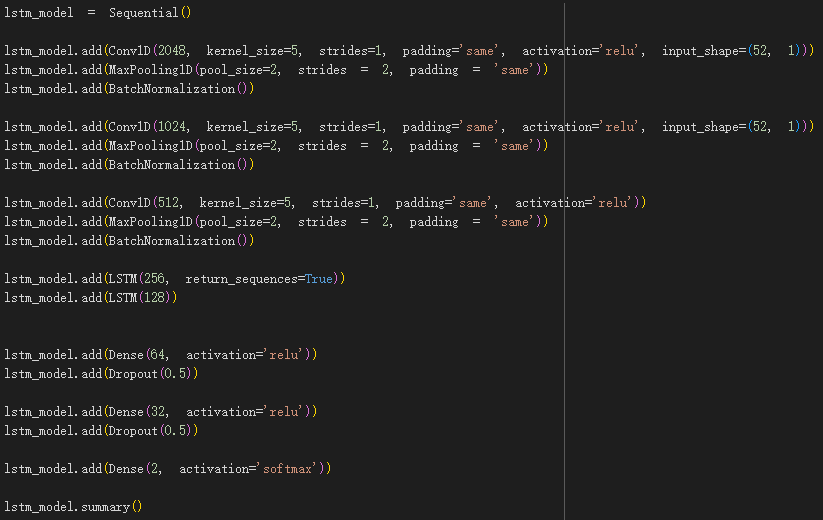
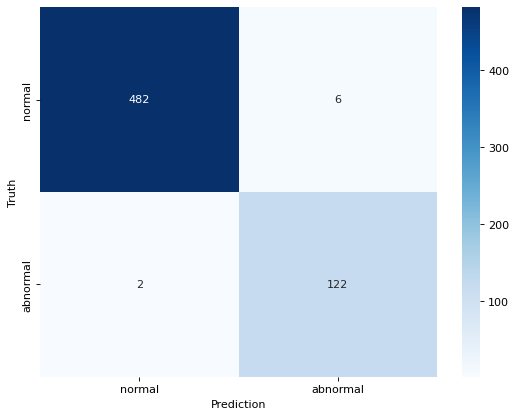
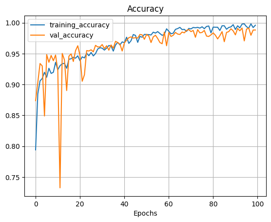

# Heartbeat Recognition with MFCC and LSTM

Created: November 4, 2023 1:00 AM
Last Edited Time: November 4, 2023 1:03 AM

# Chapter 1, Introduction

## Section 1, Research Motivation

> Due to the family members of the team having chronic heart-related illnesses, there is a certain level of concern and awareness about heart issues. During the search for a final project, we coincidentally discovered the heart sound dataset used in this project, leading us to explore the feasibility of developing an artificial intelligence model for heart disease detection through heart sound recognition.

# Chapter 2, Research Content and Methods

## Section 1, Data Preprocessing

> This section discusses the data preprocessing steps, divided into three main parts: One, Data Loading; Two, MFCC Feature Extraction; and Three, Data Class Weighting.

### One, Data Loading

> We use the Pandas library to load the pre-classified training and validation folders from the dataset. By reading the label file (reference.csv), we obtain relevant information about each data and store the data with normal and abnormal labels in the data structure.

### Two, MFCC Feature Extraction

> We segment the audio uniformly into 5-second files to standardize the samples and extract audio features using Mel-Frequency Cepstral Coefficients (MFCC).

> Mel-Frequency Cepstral Coefficients take into account the human ear's sensitivity to different frequencies, making them commonly used in speech recognition. The speech signal is pre-emphasized to highlight high-frequency components. The signal is then transformed into frames, and each frame is multiplied by a Hamming window to increase frame continuity. Afterward, the Fast Fourier Transform (FFT) is used to convert the signal from the time domain to the frequency domain. The obtained energy spectrum is multiplied by M triangular bandpass filters to obtain the logarithmic energy for each filter. After applying Discrete Cosine Transform (DCT) to the M logarithmic energy values, Mel-Frequency Cepstral Coefficients can be calculated.

### Three, Data Class Weighting

> Since the dataset has a significant class imbalance between normal and abnormal heart sounds (close to 8:2 ratio), we increase the weight of abnormal heart sounds before training the model to balance the uneven data distribution that may lead to differences during training.

> 

> Figure 1: Disparity in the ratio of normal and abnormal heart sounds

## Section 2, Model Training

### One, LSTM

> As this project deals with audio data, which is a type of data that varies over time, we decided to train the data using LSTM.

> Long Short-Term Memory (LSTM) is a type of recurrent neural network (RNN) that can address the vanishing and exploding gradient problems during training of long sequences. It is suitable for processing and predicting data with long intervals and delays in time series.

> 

> Figure 2: LSTM Architecture

# Chapter 3, Research Results

## Section 1, Model Training Results

> The model training results are presented in terms of accuracy, confusion matrix, and various model metrics.

> Figure 3: Model Accuracy

> Figure 4: Confusion Matrix

> Various model metrics:

|  | Precision | Recall | F1-score | Support |
| --- | --- | --- | --- | --- |
| Normal | 1.00 | 0.99 | 0.99 | 488 |
| Abnormal | 0.95 | 0.98 | 0.97 | 124 |
| Accuracy |  |  | 0.99 | 612 |
| Macro avg. | 0.97 | 0.99 | 0.98 | 612 |
| Weighted avg. | 0.99 | 0.99 | 0.99 | 612 |

## Section 2, Model Prediction Application Results

> The results of the model prediction application are presented in terms of accuracy, confusion matrix, and various model metrics.

1. Figure 5: Model Accuracy

    

> Figure 6: Confusion Matrix

> Various model metrics:

|  | Precision | Recall | F1-score | Support |
| --- | --- | --- | --- | --- |
| Normal | 0.71 | 0.69 | 0.70 | 150 |
| Abnormal | 0.70 | 0.72 | 0.71 | 151 |
| Accuracy |  |  | 0.70 | 301 |
| Macro avg. | 0.70 | 0.70 | 0.70 | 301 |
| Weighted avg. | 0.70 | 0.70 | 0.70 | 301 |

# Chapter 4, Conclusion

After our discussions and speculations, although the model achieved a 99% accuracy when tested with the original dataset, it could only achieve 70% accuracy in predictions. We believe this might be due to insufficient training or the significant disparity in data quantity, leading to the low prediction model accuracy. Despite our attempts to improve the model by increasing weights, there may be techniques beyond our current knowledge that could lead to better results in the future.
